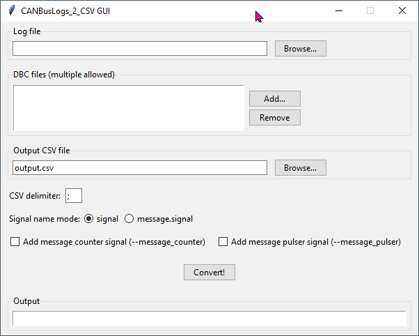

# CANBus Logs to CSV Converter 

Multi-Format CAN Log to CSV Converter

Converts CAN bus log files from various tools (BusMaster, PCAN-View, CL2000)
to CSV format using DBC files for signal decoding.

Supported formats:
- BusMaster Ver 3.2.2: "09:25:06:1260 Rx 1 0x136 x 8 13 24 C2 A1 00 00 90 FF"
- PCAN-View v4.2.1.533: "36    92.943 DT     00E3 Rx 8  FF 64 04 28 C6 58 49 08"
- CL2000: "Timestamp;Type;ID;Data"

Author: Naccini Marco
Version: 2.0.0

## Usage 

If you want to use GUI (tkinter)

At command line

	python .\CANBusLogs_2_CSV_GUI.py

Or at command line

Usage: 

	CANBusLogs_2_CSV.py [-h] [-o OUTPUT] [-d DELIMITER] [-n NAME_MODE] [-mc] [-mp] log_file dbc_files [dbc_files ...]

	Converts file logs and traces into CSV using file DBC

	positional arguments:
		log_file              Input CAN log file
		dbc_files             One or more DBC files

	options:
		-h, --help            show this help message and exit
		-o OUTPUT, --output OUTPUT
							Output CSV file (default: output.csv)
		-d DELIMITER, --delimiter DELIMITER
							CSV delimiter (default: ;)
		-n NAME_MODE, --name_mode NAME_MODE
							Signal name mode: signal = signal name only, message.signal = message + signal name mode
		-mc, --message_counter
							Increment counter signal when message appears
		-mp, --message_pulser
							Generate pulse signal when message appears

## Example  

	python CANBusLogs_2_CSV.py logfile.log database.dbc

or 

	python CANBusLogs_2_CSV.py ".\your_dir\Trace CAN1.trc" ".\your_dir\MCU.dbc" ".\your_dir\CAN1.dbc"  -o out_trc.csv -n message.signal -mp -mc
	
